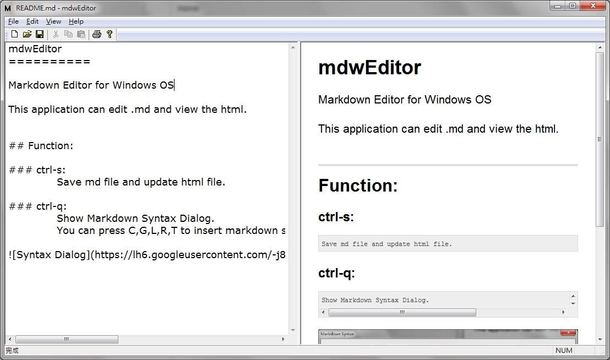
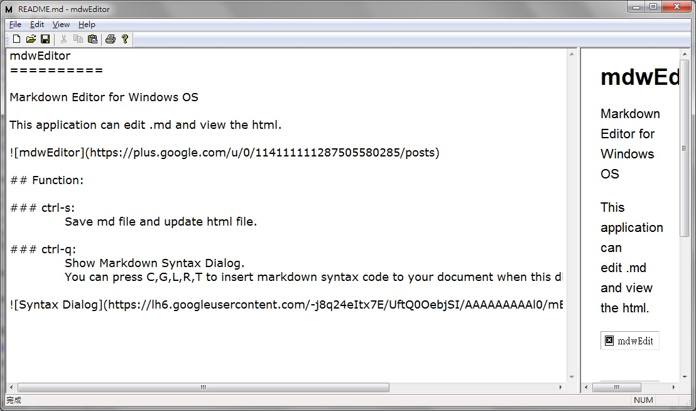
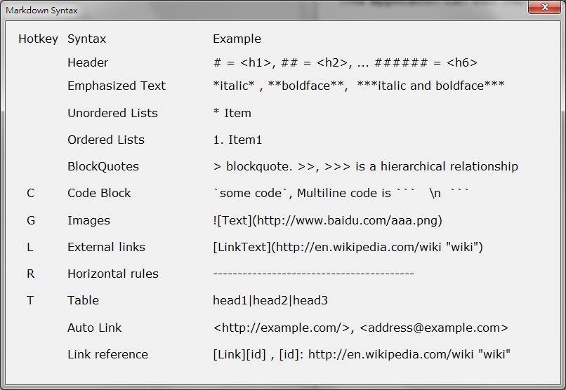

mdwEditor
==========

Markdown Editor for Windows OS

This application can edit .md and view the html. 

You don't need install this application, just download, put it into a folder you wanted and run.

## Function:

### ctrl-s:
> ##### Save md file and update html file.

### ctrl-Tab
> ##### Change focus between Edit View and Html View, and switch the View size.

> ##### change to 

### ctrl-q:
> ##### Show Markdown Syntax Dialog.
> ##### You can press C,G,L,R,T to insert markdown syntax code to your document when this dialog is showed.

### Hotkey:
> ##### Press ctrl-q+c,  ctrl-q+g,  ctrl-q+l,  ctrl-q+r,  ctrl-q+t 
> ##### will insert markdown syntax code to your document. 

### Export Html:
> ##### [File]->[Export Html] Export the html file to a file you selected.

### CSS Change:
> ##### [View]->[CSS Change] You can select a CSS file you like to replace the default CSS Style.

### CSS Default:
> ##### [View]->[CSS Default] Restore default CSS Style, preCSS file will be delete.
	