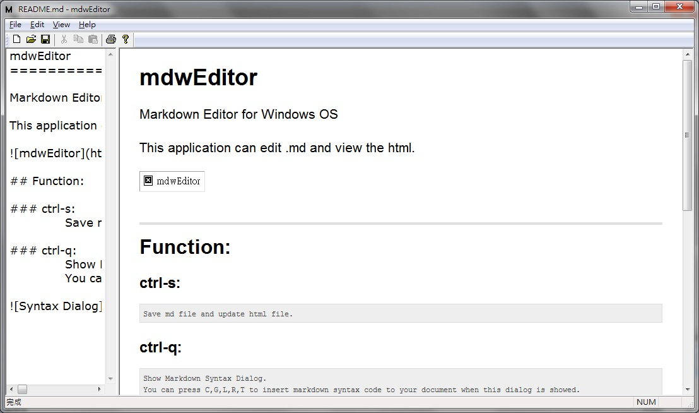

mdwEditor
==========

***Markdown Editor for Windows OS :***  [Download](http://pan.baidu.com/share/link?shareid=1631494683&uk=1511399102 "Download mdw Editor")

***This application can edit Markdown file and show HTML preview.***

***You don't need to install this application, just download, put it into a folder you wanted and run.***

## Function:

### ctrl-s:
> ##### Save md file and update html view.

### ctrl-Tab
> ##### Change focus between Edit View and Html View, and switch the View size.

> ##### change to 

### ctrl-q:
> ##### Show Markdown Syntax Dialog.
> 
> ##### You can insert markdown syntax code to your document by pressing these keys:
  **`C` : Code Block  
  `G` : Image  
  `L` : Link  
  `R` : Horizontal rule  
  `T` : Table**   

### Hotkey to insert Markdown Syntax Code:
> **`ctrl-q+c` : Code Block  
> `ctrl-q+g` : Image  
> `ctrl-q+l` : Link  
> `ctrl-q+r` : Horizontal rule  
> `ctrl-q+t` : Table**   

### Export Html:
> ##### [File]->[Export Html] Export the html file to a file you selected.

### CSS Change:
> ##### [View]->[CSS Change] You can use your CSS file to replace the default CSS Style.

### CSS Default:
> ##### [View]->[CSS Default] Restore default CSS Style. Previous CSS file will be delete.
	