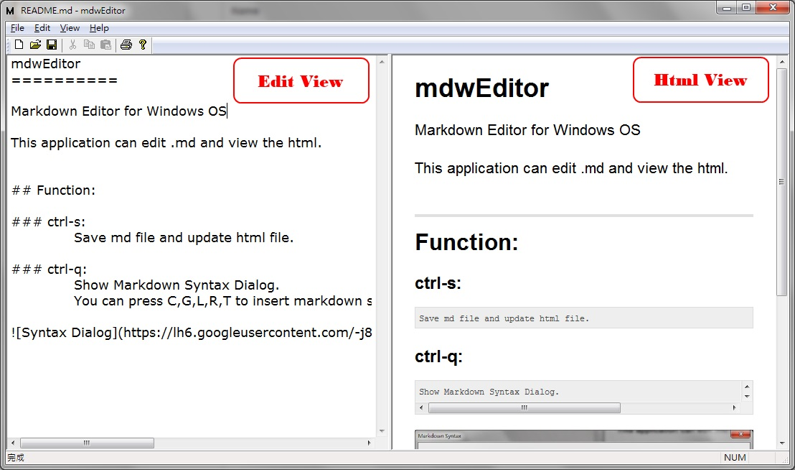

mdwEditor
==========

Markdown Editor for Windows OS

This application can edit .md and view the html.

## Function:

### ctrl-s:
	Save md file and update html file.

### ctrl-q:
	Show Markdown Syntax Dialog.
	You can press C,G,L,R,T to insert markdown syntax code to your document when this dialog is showed.

